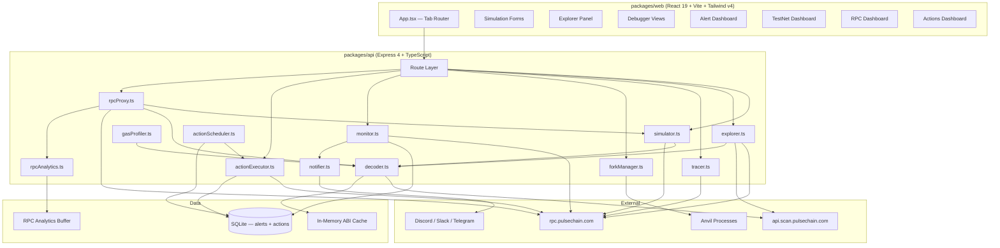
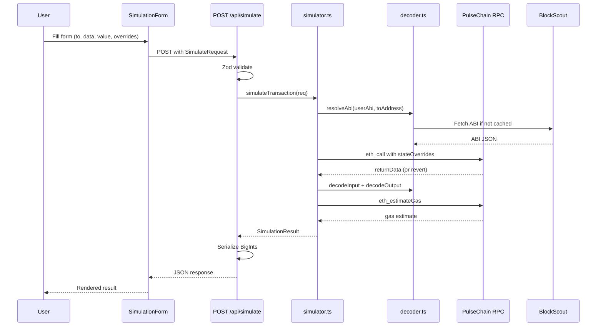
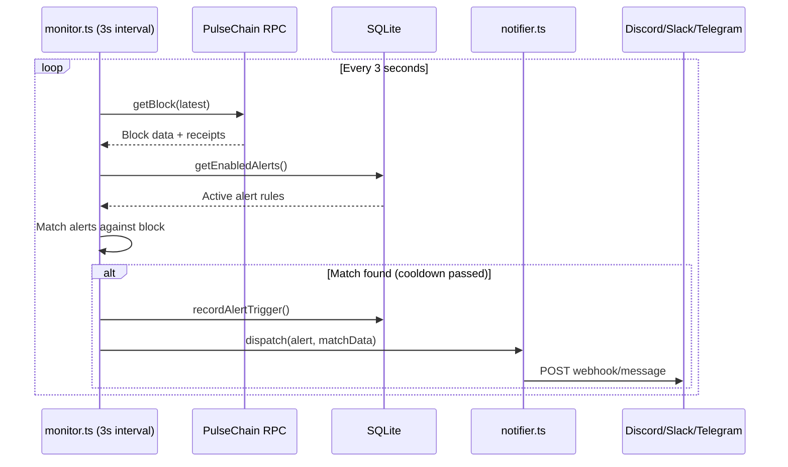
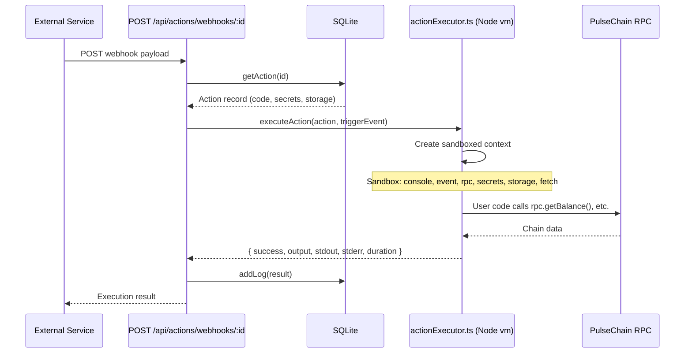

# Codebase Map

> Auto-generated by Cartographer. Last mapped: 2026-03-24

## System Overview

A **Tenderly-equivalent for PulseChain** (chain ID 369). Seven developer tools — simulation, exploration, debugging, monitoring, testnets, enhanced RPC, and serverless actions — delivered as a TypeScript monorepo with Express backend and React frontend.



## Directory Structure

```
pulsechain-dev-platform/
├── package.json              # Workspace root (npm workspaces)
├── shared/                   # Network constants (chainId, RPC URLs)
│   └── src/index.ts          # PULSECHAIN_CHAIN_ID, RPC_URL, BLOCKSCOUT_API, EXPLORER_URL
├── packages/
│   ├── api/                  # Express backend (port 3001)
│   │   ├── src/
│   │   │   ├── index.ts      # Server entry — mounts routes, starts monitor + scheduler
│   │   │   ├── types.ts      # Zod schemas for request validation
│   │   │   ├── routes/       # REST endpoints (8 route files)
│   │   │   └── services/     # Business logic (14 service files)
│   │   └── tests/
│   │       └── integration.test.ts  # 31 e2e tests (requires live server)
│   └── web/                  # React 19 SPA (Vite dev server)
│       ├── src/
│       │   ├── main.tsx      # React entry
│       │   ├── App.tsx       # Tab-based navigation (8 tabs, no URL router)
│       │   ├── types.ts      # Frontend type definitions
│       │   ├── index.css     # Tailwind v4 theme + CSS custom properties
│       │   ├── api/          # Fetch-based API clients (7 files)
│       │   └── components/   # UI components organized by feature
│       └── vite.config.ts    # Dev proxy → localhost:3001
└── docs/
    ├── SPEC.md               # Product vision and architecture overview
    └── features/             # Per-feature specs (01–07)
```

## Module Guide

### shared/

**Purpose:** Single source of truth for PulseChain network constants.

| Export | Value |
|--------|-------|
| `PULSECHAIN_CHAIN_ID` | `369` |
| `PULSECHAIN_RPC_URL` | `https://rpc.pulsechain.com` |
| `PULSECHAIN_BLOCKSCOUT_API` | `https://api.scan.pulsechain.com/api` |
| `PULSECHAIN_EXPLORER_URL` | `https://scan.pulsechain.com` |

---

### packages/api — Route Layer

| File | Path | Purpose |
|------|------|---------|
| simulate.ts | `POST /api/simulate` | Single tx simulation via eth_call |
| simulateBundle.ts | `POST /api/simulate-bundle` | Sequential multi-tx bundle simulation |
| explorer.ts | `GET /api/tx/:hash`, `/address/:addr`, `/contract/:addr`, `/block/:n` | Blockchain explorer endpoints |
| alerts.ts | CRUD on `/api/alerts` | Monitoring alert rules + test notification |
| debugger.ts | `GET /api/debug/tx/:hash/trace`, `/opcodes`, `/gas-profile`; `POST /api/debug/trace` | EVM debugger and gas profiler |
| rpc.ts | `POST /rpc`, `POST /api/rpc`; `GET /api/rpc/stats`, `/methods` | JSON-RPC proxy + analytics |
| testnets.ts | CRUD on `/api/testnets`; snapshot, revert, fund, mine, time-travel | Anvil fork lifecycle |
| actions.ts | CRUD on `/api/actions`; test, logs, webhook trigger | Serverless action management |

---

### packages/api — Service Layer

| File | Purpose | Key Exports |
|------|---------|-------------|
| rpc.ts | Shared viem PublicClient singleton (PulseChain mainnet) | `publicClient`, `pulsechain` |
| simulator.ts | Transaction simulation via eth_call with state overrides | `simulateTransaction`, `simulateBundle` |
| decoder.ts | ABI resolution (BlockScout + cache) and calldata/log decoding | `fetchAbi`, `decodeInput`, `decodeOutput`, `decodeLogs`, `resolveAbi` |
| gasEstimator.ts | Thin eth_estimateGas wrapper (returns null on failure) | `estimateGas` |
| explorer.ts | BlockScout + viem data aggregation for explorer views | `getTransactionDetails`, `getContractInfo`, `getBlockDetails`, etc. |
| tracer.ts | debug_traceTransaction (callTracer + struct logger), BlockScout fallback | `traceTransaction`, `traceTransactionOpcodes`, `traceCall` |
| gasProfiler.ts | Gas breakdown from call trees and opcode steps | `profileGas`, `profileOpcodes` |
| forkManager.ts | Anvil child process pool with port allocation, TTL cleanup | `forkManager` singleton |
| db.ts | SQLite (alerts + alert_history) via better-sqlite3 | CRUD + `recordAlertTrigger` |
| actionsDb.ts | SQLite (actions + action_logs + KV storage) via better-sqlite3 | CRUD + `addLog`, storage helpers |
| monitor.ts | Block poller (3s interval), 5 alert matchers, notification dispatch | `startMonitor`, `stopMonitor` |
| notifier.ts | Webhook/Discord/Slack/Telegram dispatcher | `dispatch` |
| actionExecutor.ts | Sandboxed JS execution via Node.js vm module | `executeAction` |
| actionScheduler.ts | Periodic/event action scheduling via setInterval | `initScheduler`, `processBlock` |
| rpcProxy.ts | JSON-RPC router: standard passthrough + pulsedev_* custom methods | `handleRpcRequest` |
| rpcAnalytics.ts | In-memory ring buffer (10k records) for RPC metrics | `rpcAnalytics` singleton |

---

### packages/web — Component Hierarchy

```
App
├── SimulationForm (+ StateOverrides, AbiInput)
├── SimulationResultPanel
├── BundleSimulator
├── AlertDashboard
│   ├── AlertBuilder
│   └── AlertHistory
├── TestNetDashboard
│   ├── CreateForkDialog
│   └── ForkControls
├── RpcDashboard
├── MethodExplorer
├── RpcTester
├── ExplorerPanel
│   ├── TxSearch
│   ├── TxDetail
│   ├── AddressView
│   ├── BlockView
│   └── ContractView (ReadFunction, WriteFunction)
├── DebuggerView
│   ├── CallTree (recursive CallNode)
│   ├── GasProfiler
│   └── OpcodeViewer
└── ActionsDashboard
    ├── ActionEditor
    └── ActionLogs
```

---

### packages/web — API Clients

| File | Backend Routes | Pattern |
|------|---------------|---------|
| api/simulate.ts | `/api/simulate`, `/api/simulate-bundle` | Direct fetch, converts StateOverride format |
| api/explorer.ts | `/api/tx`, `/address`, `/contract`, `/block` | Shared `apiFetch<T>` helper |
| api/alerts.ts | `/api/alerts` CRUD + history + test | Individual error handling per function |
| api/debugger.ts | `/api/debug/tx/:hash/*` | Never throws — returns `{ ok, debugAvailable }` |
| api/rpc.ts | `/api/rpc/*`, `/rpc` | Stats, methods catalog, test + raw RPC |
| api/testnets.ts | `/api/testnets` CRUD + operations | Shared `handleResponse<T>` helper |
| api/actions.ts | `/api/actions` CRUD + test + logs | Shared `handleResponse<T>` helper |

## Data Flow

### Transaction Simulation



### Block Monitor → Alert → Notification



### Web3 Action Execution (Webhook Trigger)



## Environment Variables

| Variable | Default | Used By |
|----------|---------|---------|
| `PORT` | `3001` | index.ts |
| `PULSECHAIN_RPC_URL` | `https://rpc.pulsechain.com` | rpc.ts, forkManager.ts, rpcProxy.ts, tracer.ts |
| `DEBUG_RPC_URL` | Falls back to PULSECHAIN_RPC_URL | tracer.ts (for debug_* methods) |
| `BLOCKSCOUT_API_URL` | `https://api.scan.pulsechain.com/api` | decoder.ts, explorer.ts, tracer.ts |

## Conventions

**Backend:**
- Express 4 with TypeScript (ES2022, strict mode, `.js` extensions in imports)
- Zod for request validation at API boundaries
- viem for all Ethereum interactions (PublicClient singleton)
- SQLite via better-sqlite3 with WAL mode and prepared statements
- Two separate databases: `data/pulsedev.db` (alerts) and `data/actions.db` (actions)
- Services export pure functions or singletons; routes wire validation to services
- BigInts serialized to strings before JSON responses

**Frontend:**
- React 19 functional components (no class components, no router library)
- Tab-based navigation via useState in App (8 tabs)
- No global state store — all state local to component trees
- Styling: Tailwind v4 utilities for layout + CSS custom properties for colors
- Dark theme only (hardcoded via CSS vars, not Tailwind dark: variant)
- API clients use native fetch with relative URLs (Vite proxy in dev)
- Discriminated union patterns for sub-view routing within dashboards

**Shared patterns:**
- Guard clauses / early returns (no nested conditionals)
- `cancelled` flag in useEffect for async cleanup
- Dashboard components own list state + sub-view discriminated union

## Gotchas

### Critical
- **vm sandbox is not secure:** `actionExecutor.ts` uses Node.js `vm.createContext` which can be escaped via prototype chain. Adequate for local dev tooling, not for multi-tenant production.
- **Forks bind to 0.0.0.0:** Anvil processes listen on all interfaces — fork RPC ports are network-accessible.
- **Bundle simulation does not propagate state:** `simulateBundle` only merges explicit `stateOverrides`, not actual on-chain state changes between transactions.
- **Monitor ↔ Action Scheduler gap:** `monitor.ts` does not call `actionScheduler.processBlock()` — block/event-triggered actions currently have no call site.

### Important
- **ABI cache never invalidates:** Requires server restart to pick up newly verified contracts on BlockScout.
- **RPC analytics are in-memory only:** Lost on server restart (10k record ring buffer).
- **RpcTester initial request bug:** `useState` initializer only runs once — the MethodExplorer → RpcTester "Try it" bridge works on first click only.
- **RpcDashboard hardcodes port 3001:** The displayed RPC URL uses `window.location.hostname:3001` regardless of environment.
- **BlockView off-by-one:** "Prev" button can navigate to block -1 (no guard like the parent hash link has).
- **AddressView null `to`:** `tx.to.toLowerCase()` throws for contract creation transactions where `to` is null.
- **ContractView uses wrong response field:** `ReadFunction` checks `json.result.decodedOutput` but the API returns `decodedReturn`.
- **"Connected" badge is cosmetic:** Never actually checks backend connectivity.

### Minor
- `getOpcodeColor` duplicated in OpcodeViewer.tsx and GasProfiler.tsx
- `StatusBadge` duplicated in SimulationResult.tsx and BundleSimulator.tsx
- `StateOverrides` allows only one empty-key storage slot at a time
- `formatMessage` in notifier.ts sets Telegram parse_mode to HTML but sends plain text
- Tab switching unmounts components — all unsaved form state is lost

## Navigation Guide

**To add a new API endpoint:**
1. Create route file in `packages/api/src/routes/`
2. Create service file in `packages/api/src/services/` if new business logic needed
3. Mount the router in `packages/api/src/index.ts`
4. Add Zod schema to `packages/api/src/types.ts` if needed
5. Add API client in `packages/web/src/api/`
6. Add integration test in `packages/api/tests/integration.test.ts`

**To add a new frontend feature tab:**
1. Add tab value to the `Tab` union type in `packages/web/src/App.tsx`
2. Create component(s) in `packages/web/src/components/<feature>/`
3. Create API client in `packages/web/src/api/<feature>.ts`
4. Add the tab button and conditional render in `App.tsx`

**To add a new alert type:**
1. Add matcher function in `packages/api/src/services/monitor.ts`
2. Add type to `createAlertSchema` Zod validator in `packages/api/src/routes/alerts.ts`
3. Add condition fields to `AlertBuilder.tsx` frontend form
4. Add test case in `integration.test.ts`

**To add a new custom RPC method:**
1. Add handler function in `packages/api/src/services/rpcProxy.ts`
2. Register in `CUSTOM_HANDLERS` map and `SUPPORTED_METHODS` array
3. Update `packages/web/src/components/rpc/MethodExplorer.tsx` template (auto-fetched from API)

**To modify notification channels:**
1. Add send function in `packages/api/src/services/notifier.ts`
2. Update `dispatch` function to include new channel type
3. Add channel config UI in `AlertBuilder.tsx`

## Tech Stack Summary

| Layer | Technology |
|-------|-----------|
| Frontend | React 19, Vite 6, Tailwind CSS v4, TypeScript 5.7 |
| Backend | Express 4, TypeScript 5.7, tsx (dev runner) |
| Ethereum | viem 2.23 (client), Anvil/Foundry (forks) |
| Validation | Zod 3.24 |
| Database | better-sqlite3 12.8 (WAL mode, two DB files) |
| External APIs | PulseChain RPC, BlockScout REST API |
| Testing | Node.js built-in test runner (node:test) |
| Notifications | Webhook, Discord, Slack, Telegram |
